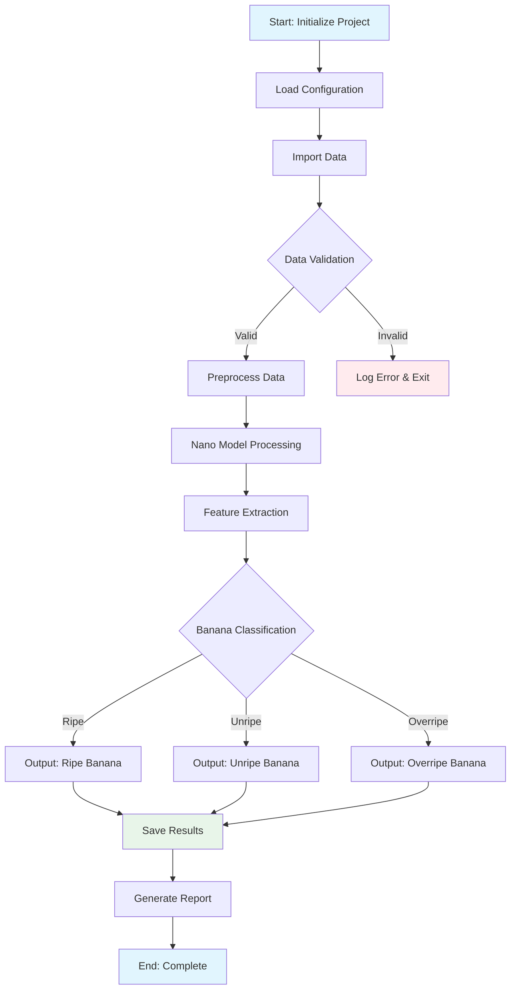
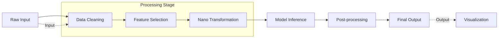
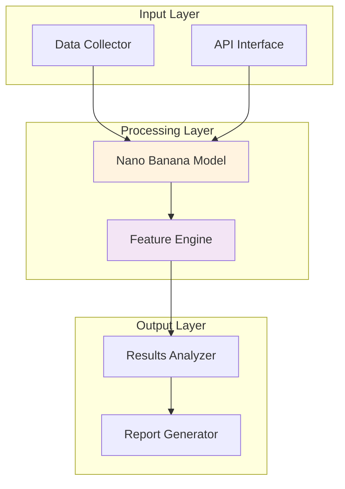
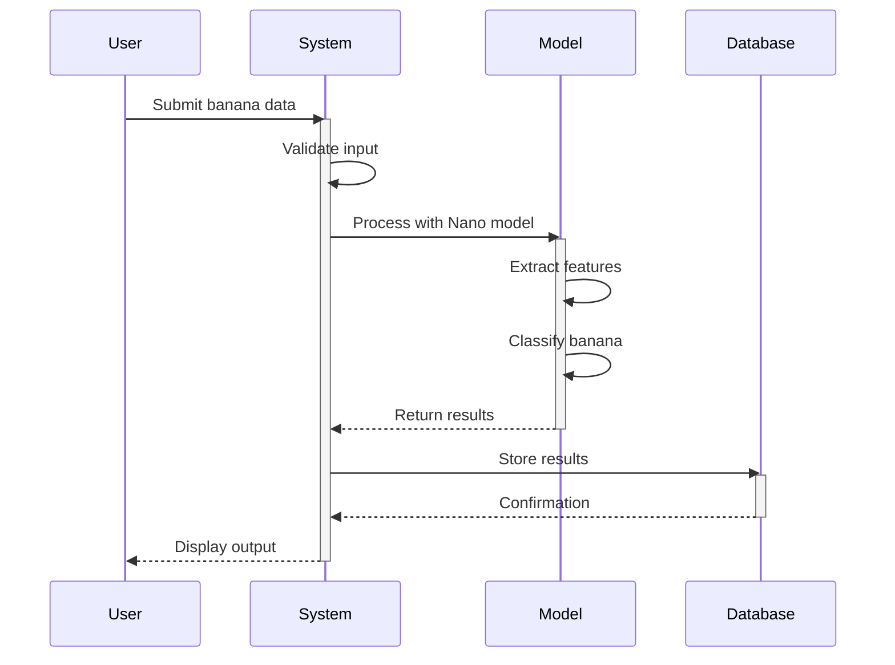
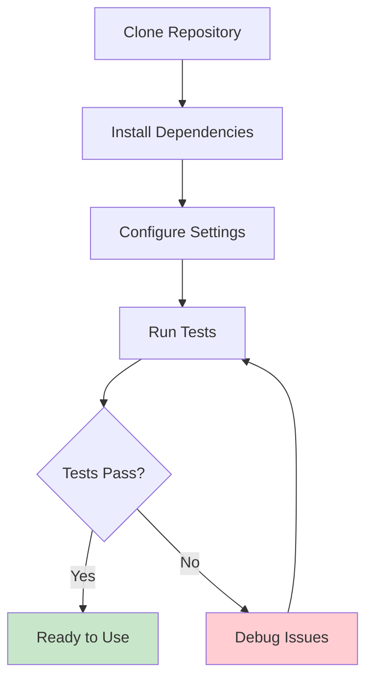

# Project Flowchart

## System Architecture Flowchart

## Data Processing Pipeline

## Component Interaction Diagram

## Workflow Sequence

## Installation Flow

*Note: All flowcharts are created using Mermaid syntax and can be rendered in any Mermaid-compatible viewer.*
